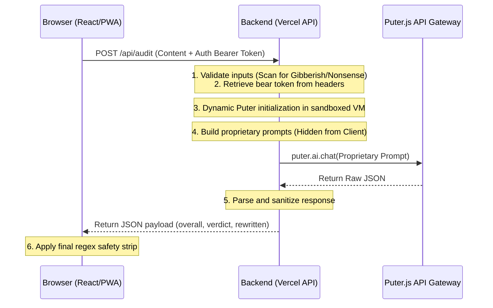

# 🚀 AlgoCheat AI — The 2026 LinkedIn Algorithm Cheat Code

**AlgoCheat AI** is a free, PWA-ready, privacy-first LinkedIn content auditor and optimizer. It analyzes your posts against 10 strict 2026 LinkedIn algorithm parameters, detects your personal writing voice fingerprint, and provides a 10/10 optimized rewrite that sounds like *you*—not ChatGPT.

---

## 🛠️ Key Features

*   **📝 Text Post Audit:** Tailored for text-only posts; scores hooks, dwell-time layouts, authentic voice, value density, narrative arcs, and conversation triggers.
*   **🖼️ Image Post Audit:** Optimizes graphics, photo posts, and multi-page carousels, checking caption-image synergy and alt-text accessibility.
*   **📖 Article Audit:** Calibrated for long-form LinkedIn articles and newsletters, checking SEO titles, meta-descriptions, subhead hierarchy, and tl;dr blocks.
*   **✍️ The Refinement Engine ("Want any change?"):** Type instructions in plain English (e.g., *"add emojis"*, *"make it 30% shorter"*, *"add a Hindi line at the end"*). It features:
    *   **Double-Hook Prevention:** Replaces hook lines instead of stacking them.
    *   **Hashtag Preservation:** Retains niche hashtags at the bottom during edits.
    *   **Phantom Link Prevention:** Blocks AI from hallucinating *"click the link"* language when no link is provided.
*   **🤖 Predicted 100/100 Generator:** Drop a topic, niche, or angle, answer 4 quick founder questions, and get a ready-to-publish post.
*   **🧠 Automatic Sanitizer Safety Net:** Deteminstically strips out trailing AI self-evaluations and footnotes (e.g. *"This post scores highly..."*) before displaying or copying.

---

## 🔒 Security & Logic Protection Architecture

AlgoCheat is built with a secure **Double-Guard Architecture** protecting proprietary prompt engineering and dynamic tokens:



1.  **Prompts-as-a-Service (PaaS):** proprietary system prompts are stored entirely on the serverless backend (`api/shared.js`) to keep them hidden from browser DevTools inspect panels.
2.  **Dynamic Sandboxed Puter Clients:** Puter auth tokens are passed via Bearer headers and loaded dynamically in secure sandboxed VMs (`vm.createContext`) on Vercel endpoints, preventing token leakages.
3.  **Edge Scanners:** Checks inputs for gibberish/spam to prevent prompt injections and resource abuse.
4.  **Iframe Protections:** Employs strict CSP `frame-ancestors 'none'` and `X-Frame-Options: DENY` configurations to block clickjacking wrappers.

---

## 💻 Tech Stack

*   **Frontend:** React (TypeScript) + Vite PWA
*   **Styling:** Tailwind CSS + Shadcn UI
*   **Core SDK:** Puter.js (client-side LLM gateway)
*   **Hosting & Backend:** Vercel (Serverless Functions)

---

## 🚀 Local Development

Follow these steps to run and build the application locally:

### 1. Install Dependencies
```bash
npm install
```

### 2. Run the Development Server
```bash
npm run dev
```

### 3. Build for Production
```bash
npm run build
```

### 4. Deploy to Vercel
```bash
npx vercel --prod
```
