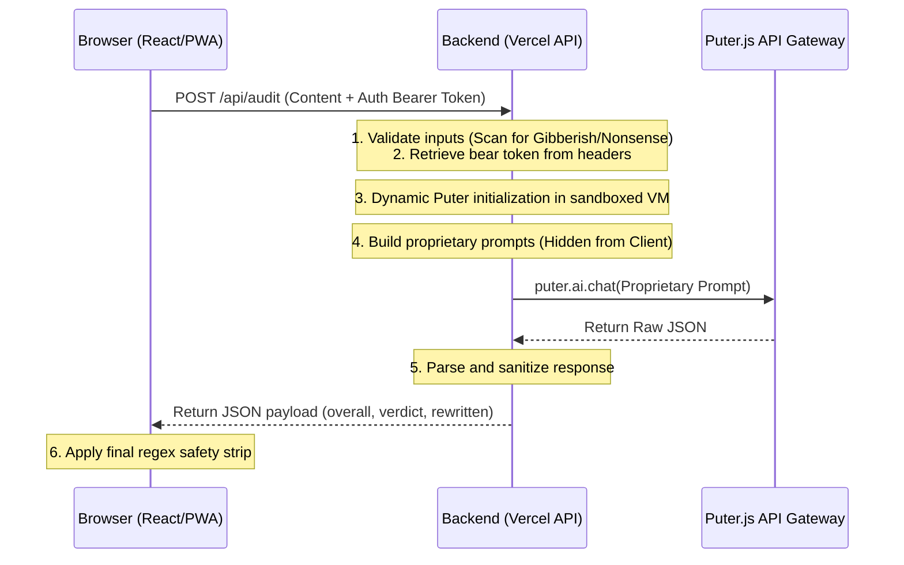

# 🚀 AlgoCheat AI — The 2026 LinkedIn Algorithm Cheat Code

<div align="center">

[](https://opensource.org/licenses/MIT)
[](https://react.dev/)
[](https://vitejs.dev/)
[](https://algocheatai.vercel.app)
[](https://algocheatai.vercel.app)

**A 100% Free, Privacy-First, client-side LinkedIn post auditor and voice-preserved rewriter.**

[Try the Live Web App](https://algocheatai.vercel.app) • [View License](./LICENSE) • [Report Issues](https://github.com/bobtech-IIT/AlgoCheatAI/issues)

---
</div>

**AlgoCheat AI** helps creators, builders, and professionals bypass the "invisible penalties" of the LinkedIn algorithm. Instead of rewriting your post in a robotic ChatGPT voice, AlgoCheat detects your personal writing voice fingerprint, scores your draft against 10 strict 2026 organic reach metrics, and delivers an optimized version that sounds exactly like you.

---

## ✨ Key Capabilities

*   **📝 Text Post Audit:** Tailored for standard posts. Analyzes hooks, spacing, value density, narrative arcs, and conversation triggers.
*   **🖼️ Image & Carousel Audit:** Checks caption-image synergy and alt-text accessibility for visual assets.
*   **📖 Article/Newsletter Audit:** Optimizes long-form text with SEO headlines, H2/H3 subhead hierarchies, and scannable TL;DR blocks.
*   **✍️ The Refinement Engine ("Want any change?"):** Fine-tune outputs using plain English commands (e.g. *"add emojis"*, *"make it punchier"*). Features built-in:
    *   **Double-Hook Prevention:** Intelligently replaces the old hook instead of stacking them.
    *   **Hashtag Preservation:** Retains and formats 3-5 niche tags at the bottom.
    *   **Phantom Link Prevention:** Blocks the AI from writing *"click the link"* when no link exists.
*   **🤖 Predicted 100/100 Generator:** Answer 4 context-gathering questions and get an instant, high-performing post tailored to your story.
*   **🧠 Automatic Sanitizer Safety Net:** Deterministically strips trailing AI comments, scorecards, or footnotes before you copy the text.

---

## 🔒 Security & Logic Protection Architecture

AlgoCheat utilizes a **Double-Guard Architecture** to protect proprietary prompt logic and Puter auth keys:



1.  **Backend Abstraction (PaaS):** proprietary prompt templates and scoring rubrics are hosted on Vercel backend serverless endpoints (`api/shared.js`), hiding them completely from browser DevTools.
2.  **Dynamic Sandboxed Client Loading:** Puter authentication tokens are passed via standard Authorization headers and initialized dynamically inside backend sandboxed VMs (`vm.createContext`), preventing key exposure.
3.  **Abuse Prevention Scanners:** Pre-scans inputs for gibberish/spam to block resource exhaustion.
4.  **Embed Protections:** Uses strict CSP rules (`frame-ancestors 'none'`) and `X-Frame-Options: DENY` in `vercel.json` to prevent iframe clickjacking.

---

## 💻 Tech Stack

*   **Frontend:** React 18 + TypeScript + Vite PWA
*   **Styling:** Tailwind CSS + Shadcn UI
*   **Core AI Engine:** Puter.js (Client-side AI API gateway)
*   **Serverless Layer & Hosting:** Vercel (Serverless Functions)

---

## 🚀 Local Development

Get the project running on your local machine in three steps:

### 1. Install Dependencies
```bash
npm install
```

### 2. Launch Local Server
```bash
npm run dev
```

### 3. Compile Production Build
```bash
npm run build
```

---

## 📄 License

This project is licensed under the MIT License - see the [LICENSE](./LICENSE) file for details. Built purely as a passion project for the developer/creator community.
